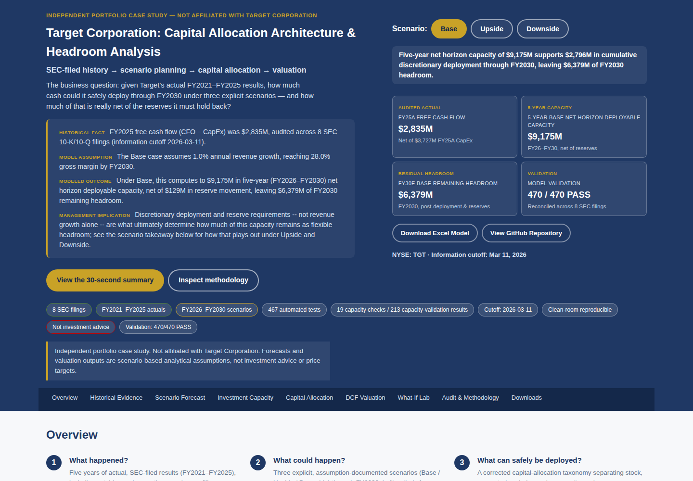
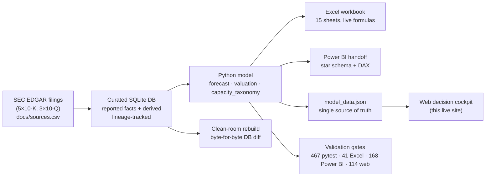
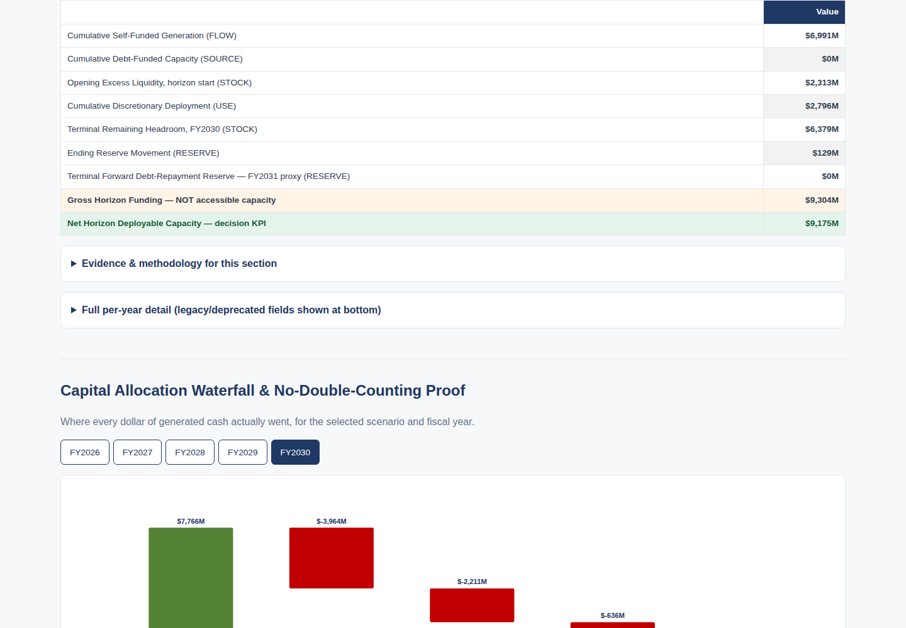

# Target Cash Flow & Investment Capacity Decision Cockpit

**How much capital can Target deploy without double-counting liquidity or compromising its operating cash reserve?**

**[Live decision cockpit →](https://jpatel-strategy.github.io/cash-flow/)** · **[Executive case study →](deliverables/portfolio_package/01_executive_case_study.md)** · **[Model risks and limitations →](deliverables/portfolio_package/05_model_risk_and_limitations.md)**



> **This is an independent, external case study — not affiliated with, endorsed by, or evidence of adoption by Target Corporation.** It is not Target's internal forecast, not investment advice, and the DCF outputs are not price targets. Every figure past the FY2025 10-K is a labeled scenario assumption, never a prediction. See [Model risks and limitations](deliverables/portfolio_package/05_model_risk_and_limitations.md) and [`docs/limitations.md`](docs/limitations.md) for the full scope statement.

## What makes this project different

Most portfolio finance models stop at "here's a forecast." This one is built like a real strategic-finance deliverable would need to survive audit:

- **Built entirely from public SEC filings** — 8 filings (5×10-K, 3×10-Q), CIK `0000027419`, every figure traceable to a specific accession number and XBRL tag, with reported facts and derived values never blurred together.
- **A real historical-data bug, caught and documented, not hidden.** Cross-checking the same historical quarters across successive filing vintages surfaced a genuine cost-of-sales/SG&A reclassification Target made to two prior fiscal years with zero revenue or net-income impact — the kind of restatement that silently breaks a model that trusts a single filing in isolation.
- **The headline capacity metric failed three semantic audits, in public.** An early "cumulative deployable capacity" figure was double- and triple-counting unused cash carried forward year to year, overstating true capacity by roughly 2.6x–3.8x. Three successive corrections split the metric into six honestly-scoped concepts — a stock, a flow, a source, a use, and a reserve, never blended — and it shipped anyway, with the full before/after audit trail intact in `docs/investment_capacity_semantic_audit.md` and `docs/investment_capacity_correction_evidence.md`, rather than quietly overwritten.
- **Four decision-support formats from one source of truth**: a live-formula Excel workbook, a Power BI-ready star-schema handoff, this web decision cockpit, and a recruiter package — all generated from the same SQLite-backed model, never hand-typed into any of the four.
- **Reproducible, not just tested.** A from-scratch clean-room rebuild reconstructs the entire database from nothing but the registered source manifest and re-derives every downstream number, then diffs it byte-for-byte against the shipped database.

## Architecture / evidence chain



Every arrow above is independently checked: the Python model never recomputes by hand what the database says, the Excel and Power BI exports are checked cell-for-cell and row-for-row against the live database, and the web cockpit is checked against the Python model in a real headless browser — not just unit-tested in isolation.

## FY2030 scenario results

| Metric | Base | Upside | Downside |
|---|---:|---:|---:|
| Revenue | $110,125M | $121,469M | $92,321M |
| Diluted EPS | $8.18 | $13.15 | $2.71 |
| Opening Excess Liquidity (stock) | $5,424M | $2,218M | $6,158M |
| Self-Funded Capacity Generated (flow) | $1,591M | $2,024M | $30M |
| Net Debt-Funded Capacity | $0M | $0M | $200M |
| Discretionary Deployment (use) | $636M | $1,498M | $0M |
| Forward Debt-Repayment Reserve | $0M | $700M | $0M |
| **Remaining Deployable Headroom** (decision KPI) | **$6,379M** | **$2,044M** | **$6,388M** |
| DCF Scenario Value/Share | $107.29 | $138.32 | $61.55 |

Five-year (FY2026–FY2030) horizon reconciliation: Base gross horizon funding ≈$9,304M / net horizon deployable capacity ≈$9,175M; Upside gross ≈$8,527.1M; Downside gross ≈$6,092.3M. Gross horizon funding is **explicitly not accessible capacity** — it is shown only to make the reconciliation to the net decision KPI auditable, never as a number to plan against.

### Why Upside has *less* remaining headroom than Base or Downside

This is the counterintuitive result the model is built to surface honestly rather than smooth over. Upside generates the most cash of any scenario ($2,024M self-funded capacity, the highest revenue and EPS), but it also *deploys* the most of it — $1,498M in discretionary buybacks plus a $700M forward debt-repayment reserve, versus $636M and $0 in Base. The scenario that performs best operationally is, by construction, the scenario that leaves executives with the least *undeployed* headroom at the end of FY2030 — because Upside is the case where the business found the most good uses for its cash, not the case where it accumulated the most idle cash. Remaining Deployable Headroom answers "what's left to deploy," not "how well did the business do," and the two are not the same question.

## Corrected investment-capacity view



The cockpit shows gross horizon funding and net horizon deployable capacity as two distinct, separately labeled rows — never as a single blended figure — with the reconciliation identity (`Net = Gross − ending reserve movement − terminal forward reserve`, which also independently equals `cumulative discretionary deployment + terminal remaining headroom`) checked in both the Python model and the rendered page.

## Evidence and validation

| Gate | Result | Independent? |
|---|---|---|
| `pytest -q` (unit + integration) | **467 / 467 passed** | Yes — exercises the fetch/normalize/reconcile/validate/forecast/valuation/capacity pipeline directly |
| `scripts/verify_excel_model.py` | **41 / 41 passed** | Yes — recalculates the live workbook (LibreOffice formula engine) and diffs every cell against Python |
| `scripts/verify_powerbi_handoff.py` | **168 / 168 passed** (documented in `docs/investment_capacity_correction_evidence.md` §27.3) | Yes — diffs exported CSVs row-for-row against the live database; not independently re-run for this release (see *Known limitations*) |
| `scripts/verify_web_cockpit.py` (Playwright, headless Chromium) | **114 / 114 passed** | Yes — loads the real rendered page and checks it against the Python model, not against its own JSON |
| `node --check` on all cockpit JS | Clean (no syntax errors) | — |
| `scripts/clean_room_rebuild.py` | Documented byte-for-byte match in prior milestone evidence; not independently re-run for this release (see *Known limitations*) | Yes, when run |
| Forecast / valuation / capacity validation results | **470 / 470 passed** (229 forecast + 28 valuation + 213 capacity) | Yes — deterministic, arithmetic reconciliation checks generated from the model itself |
| Source filings | **8 SEC filings** (5×10-K, 3×10-Q), CIK 0000027419 | Each hash-recorded in `docs/sources.csv` |

Not all 470 arithmetic reconciliation checks are independent audits of the underlying judgment calls — they confirm the model is internally consistent (e.g. a waterfall sums to its total), which is necessary but not sufficient for correctness on its own. The historical filing-vintage cross-check and the three capacity-taxonomy semantic audits are the checks that catch judgment errors, and both are documented with full before/after evidence rather than summarized as a pass count.

## Deliverables

| Deliverable | Location | Format |
|---|---|---|
| Web decision cockpit (this live site) | `deliverables/web_cockpit/` | Static HTML/CSS/JS, GitHub Pages |
| Excel executive workbook | `deliverables/Target_Cash_Flow_Investment_Capacity_Model.xlsx` | 15 sheets, live formulas, scenario selector |
| Power BI handoff package | `deliverables/powerbi_handoff_package.zip` / `deliverables/powerbi_handoff/` | Star-schema CSVs, DAX measures, page specs — no `.pbix` file exists or is claimed |
| Recruiter / portfolio package | `deliverables/portfolio_package/` | 13 markdown documents: case study, methodology, data dictionary, limitations, demo script, resume bullets |
| Governing decision log | `docs/decisions.md` | Every material judgment call and bug fix, across all 8 milestones |
| Capacity correction audit trail | `docs/investment_capacity_semantic_audit.md`, `docs/investment_capacity_correction_evidence.md` | Full before/after evidence for all three semantic corrections |

## Architecture summary

A Python package (`src/target_cash/`) implements fetch → normalize → reconcile → validate → forecast → valuation → capacity_taxonomy as CLI-driven, individually testable stages, each writing to a SQLite database (`data/curated/target_cash.db`) with full source-to-output lineage. `scripts/build_web_cockpit_data.py` exports one JSON file (`deliverables/web_cockpit/data/model_data.json`) from a live run of that model — never hand-edited — and every downstream artifact (Excel, Power BI, the web cockpit) is checked against that same live model, not against each other. The web cockpit itself is a dependency-free static site (no build step, no backend, no external chart library) that fetches the JSON and renders all 9 required sections client-side, including a browser-only "What-If Lab" that is visually and functionally separated from the published, authoritative figures.

## Local setup and reproduction

```bash
python3 -m venv .venv
source .venv/bin/activate
pip install -e .
pip install pytest formulas playwright

# Run the full test suite
pytest -q

# Verify the Excel workbook and Power BI handoff against the live database
python scripts/verify_excel_model.py
python scripts/verify_powerbi_handoff.py

# Serve and verify the web cockpit
cd deliverables/web_cockpit && python3 -m http.server 8080 &
cd ../.. && python scripts/verify_web_cockpit.py

# Full clean-room rebuild (reconstructs the database from source filings only)
python scripts/clean_room_rebuild.py
```

Historical data acquisition requires manually-registered SEC filing documents (`target-cash fetch --mode manual`, see `docs/decisions.md`) because this project's own execution environments have consistently had `data.sec.gov` / `www.sec.gov` blocked by network policy — a genuine SEC EDGAR HTTP client exists in `src/target_cash/fetch.py` for environments where that access is open.

## Known limitations

- **This is a case study, not Target's internal work, an investment recommendation, or evidence of Target's adoption.** See [`deliverables/portfolio_package/05_model_risk_and_limitations.md`](deliverables/portfolio_package/05_model_risk_and_limitations.md) for the full model-risk statement.
- **No `.pbix` file exists**; the Power BI deliverable is a verified data/DAX/page-spec handoff package, not a native Power BI Desktop file, and no native Power BI Desktop verification has been performed.
- **The DCF's cost-of-equity inputs (risk-free rate, equity risk premium, beta) are illustrative market conventions, not live market data** — there is no live-market-data source in the registered source set. Cost of debt and the tax rate are grounded in the model's own FY2024–FY2025 historical figures.
- **`scripts/verify_powerbi_handoff.py` and `scripts/clean_room_rebuild.py` require the live curated SQLite database, rebuilt from the raw cached SEC filing documents.** Those raw documents are deliberately excluded from version control (large, and re-derivable from `docs/sources.csv`) and this release's execution environment could not reach SEC EDGAR to re-fetch them (network policy — the same limitation described above and in `docs/limitations.md`). Their 168/168 and prior clean-room-match results are carried forward from `docs/investment_capacity_correction_evidence.md` as documented evidence, not independently re-run for this specific release. `pytest`, the Excel verification, and the web cockpit verification were all re-run fresh for this release and all pass.
- Not all arithmetic validation checks are independent judgment audits — see the note under *Evidence and validation* above.

## Author

Built by **Jay Patel** ([linkedin.com/in/jpatel-strategy](https://www.linkedin.com/in/jpatel-strategy)) — MBA candidate (finance & analytics), building toward FP&A / strategic finance, management consulting, and AI-governance roles. This project was built to demonstrate financial and operational judgment supported by technical execution — not as a software-engineering portfolio piece. See [`deliverables/portfolio_package/06_positioning_note.md`](deliverables/portfolio_package/06_positioning_note.md) for how this project is meant to be discussed in an interview, and [`deliverables/portfolio_package/07_demo_script.md`](deliverables/portfolio_package/07_demo_script.md) for a guided walkthrough.
